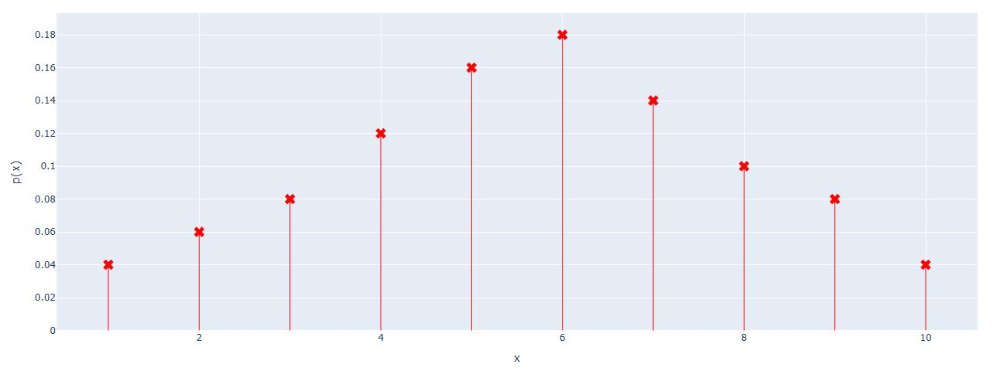

# Plot PMF with Plotly

A simple Python function for plotting a **Probability Mass Function (PMF)** of a discrete random variable using [Plotly](https://plotly.com/python/).

## Features

* Plot a discrete probability distribution as a line chart.
* Display probability values for each possible value of the random variable.
* Customize the line color.
* Customize the marker symbol.
* Validate that the sum of probabilities is equal to 1.

## Installation

First, install Plotly:

```bash
pip install plotly
```
from math import isclose

## Usage

Import the function and provide:

* `x`: Values of the discrete random variable.
* `y`: Probability corresponding to each value of `x`.
* `color_line`: Color of the PMF line.
* `marker_symbol`: Marker symbol used for each probability.

### Example

```
import plotly.graph_objects as go
from math import isclose

fig = go.Figure()

x = [1, 2, 3, 4, 5, 6,7,8,9,10]
p_x = [0.04,0.06,0.08,0.12,0.16,0.18,0.14,0.10,0.08,0.04]

fig= plot_PMF(fig,x,p_x,"red","x")


fig.update_yaxes(title_text="p(x)")
fig.update_xaxes(title_text="x")

fig.show()
fig.write_html('first_figure1.html', auto_open=True)
```
## Example Output



## Parameters

| Parameter       | Description                                                   |
| --------------- | ------------------------------------------------------------- |
| `fig`           | Plotly Figure object (`go.Figure`)                            |
| `x`             | Values of the discrete random variable                        |
| `y`             | Probability corresponding to each value of `x`                |
| `color_line`    | Color of the PMF line, such as `"red"`, `"blue"` or `"green"` |
| `marker_symbol` | Marker symbol used in the plot                                |

## Marker Symbols

Plotly provides several marker symbols that can be used with `marker_symbol`.

Examples:

```python
marker_symbol="circle"
marker_symbol="square"
marker_symbol="diamond"
marker_symbol="cross"
marker_symbol="x"
triangle-up
```

For example:

```python
plot_PMF(
    fig,
    x,
    y,
    color_line="red",
    marker_symbol="diamond"
)
```

## Probability Validation

The probabilities in `y` should form a valid probability distribution.

Therefore:

```python
sum(y) = 1
```

For numerical calculations, it is better to use `isclose()` rather than checking exact equality:

```python
from math import isclose

if not isclose(sum(y), 1):
    raise ValueError("The sum of probabilities must be equal to 1.")
```

This avoids problems caused by floating-point precision.

## Example Probability Distribution

Consider the following discrete probability distribution:

```python
x = [1, 2, 3, 4, 5]

y = [
    0.10,
    0.20,
    0.30,
    0.25,
    0.15
]
```

The sum of the probabilities is:

```python
0.10 + 0.20 + 0.30 + 0.25 + 0.15 = 1.0
```

The function can then be used to visualize this PMF.

## Output

The function produces a Plotly interactive figure where:

* The **x-axis** represents the possible values of the random variable.
* The **y-axis** represents their corresponding probabilities.
* Markers show the probability at each discrete value.
* The line connects the probability values.
